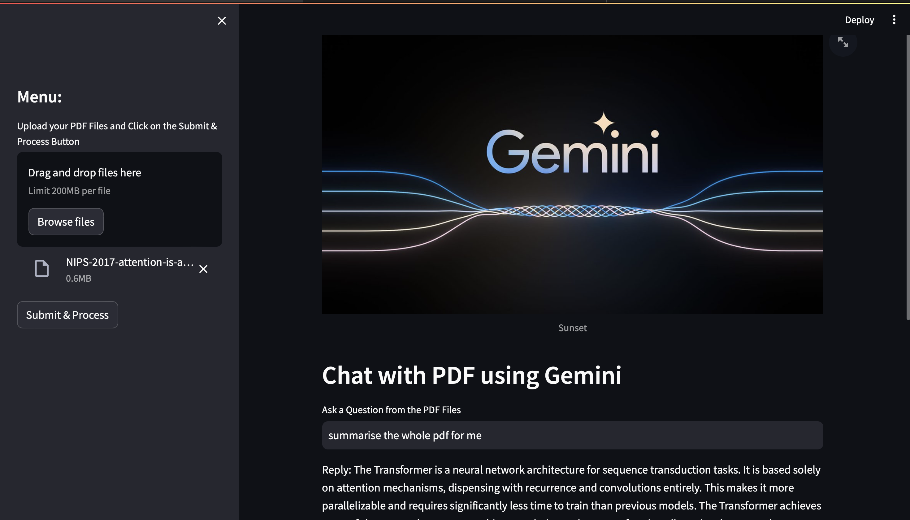

# Chat with PDF using Gemini

This Streamlit app allows users to chat with a PDF using Gemini, a conversational AI model.

## Demo



## Features

- Upload PDF files and ask questions.
- Get detailed answers from the PDF content using Gemini's conversational capabilities.

## Installation

1. Clone the repository:

    ```bash
    git clone https://github.com/yatin-kundra/chat-with-pdf.git
    ```

2. Install the required dependencies:

    ```bash
    pip install -r requirements.txt
    ```

3. Set up your Google API key by creating a `.env` file and adding the following line:

    ```bash
    GOOGLE_API_KEY=your-api-key
    ```

    Replace `your-api-key` with your actual Google API key.

    You can get your api key [here](https://aistudio.google.com/app/apikey)

## Usage

1. Run the Streamlit app:

    ```bash
    streamlit run main.py
    ```

2. Upload PDF files containing text content.
3. Ask questions related to the content of the PDF files.
4. Receive detailed answers from the Gemini conversational AI model.

## Credits

- [Streamlit](https://streamlit.io/) - For creating interactive web apps with Python.
- [PyPDF2](https://github.com/mstamy2/PyPDF2) - For reading PDF files in Python.
- [Langchain](https://langchain.io/) - For NLP tools and models.
- [Google Generative AI](https://github.com/google-research/google-research/tree/master/generative_ai) - For generative AI models.
